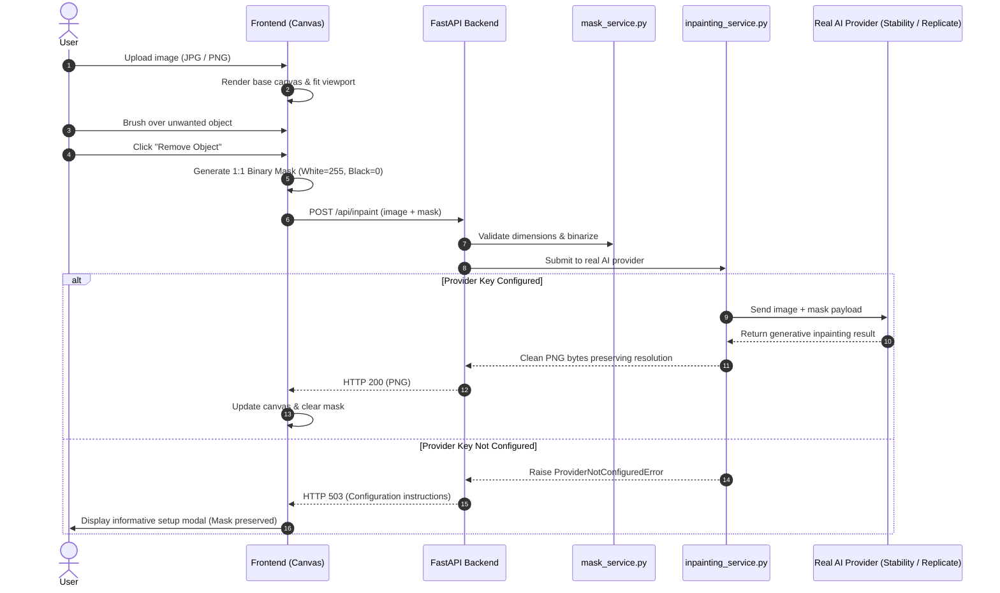

# AI Object Remover 🎨✨

An original, production-ready web application inspired by modern AI photo editing tools. **AI Object Remover** allows users to paint over unwanted objects, people, or text in their photos and remove them using state-of-the-art generative AI inpainting models.

> **Project Notice**: This is an original student project built cleanly from scratch. It does not copy any proprietary branding, logos, code, or private APIs.

---

## 🌟 Key Features

### Frontend (HTML5 / Vanilla CSS / JavaScript)
- **Modern Clean Light UI**: Polished studio aesthetic with rounded cards, subtle shadows, and crisp typography. Strict light theme with no dark mode.
- **Multi-layer Canvas Engine**:
  - **Base Canvas**: Preserves full original image resolution without stretching or cropping.
  - **Overlay Canvas**: Displays a semi-transparent brush selection overlay (`rgba(239, 68, 68, 0.65)`).
  - **Binary Mask Export**: Generates an exact 1:1 binary mask (White `255` = area to remove, Black `0` = area to preserve).
- **Subpixel Coordinate Mapping**: Uses precise bounding-client-rect scaling (`originalWidth / displayWidth`) so user brush strokes remain accurate across all screen sizes and zoom levels.
- **Precision Tooling**:
  - Interactive Brush tool with adjustable size slider (5px - 150px) and preset pills.
  - Dynamic brush cursor that renders the true scaled radius directly on the photo.
  - Eraser tool for cleaning up accidental strokes.
  - Full Undo, Redo, and Reset history stack.
  - Zoom controls (Fit, 100%, Zoom in/out).
  - High-resolution PNG download.
- **Stepped Progress State**:
  - Multi-stage visualizer: *Preparing image* → *Creating selection mask* → *Sending to AI* → *Reconstructing background* → *Finalizing image*.

### Backend (Python / FastAPI)
- **Strict Real AI Policy**:
  - **Zero fake AI processing**: Does not implement object removal using blur, gradient, cloning, or simple pixel filling.
  - Designed specifically for real AI inpainting pipelines.
- **Safe Standby Mode**:
  - When an AI provider API key is not configured, returns a clear HTTP 503 response with setup instructions rather than falsifying removal. The user's painted selection is preserved on the canvas.
- **Multi-Provider Architecture**:
  - **Stability AI** (`v2beta/stable-image/edit/inpaint`)
  - **Clipdrop Cleanup API** (`cleanup/v1`)
  - **Replicate** (Stable Diffusion Inpainting / LaMa)
  - **Fal.ai** (`fast-sd-inpaint`)
  - **Hugging Face Inference API**
- **Robust Mask Service**:
  - Binarizes selection masks strictly into single-channel 8-bit images.
  - Verifies dimension alignment with original image.
  - Detects and rejects empty masks before sending to providers.

---

## 📁 Project Structure

```
ai-object-remover/
├── frontend/
│   ├── index.html       # Clean semantic UI with drag-drop and editor
│   ├── style.css        # Professional light-mode styling & canvas layout
│   └── script.js        # Canvas painting engine, coordinate mapping, API client
├── backend/
│   ├── app.py           # FastAPI server, CORS, /api/inpaint & /api/status endpoints
│   ├── requirements.txt # Python dependencies
│   ├── .env.example     # Environment template with supported provider keys
│   └── services/
│       ├── mask_service.py       # Strict binarization and dimension validation
│       └── inpainting_service.py # Real AI provider adapter architecture
└── README.md            # Project documentation & setup instructions
```

---

## 🚀 Quick Start

### Prerequisites
- Python 3.10+ (Tested on Python 3.14)
- Web browser (Chrome, Edge, Firefox, Safari)

### 1. Installation

Clone or navigate to the project directory:

```bash
cd ai-object-remover/backend
```

Install the required Python dependencies:

```bash
pip install -r requirements.txt
```

### 2. Configure Real AI Inpainting Provider (Optional)

Copy the environment template:

```bash
cp .env.example .env
```

Open `.env` and add your API key for any supported provider:

```env
# Choose provider: stability | replicate | clipdrop | fal | huggingface
INPAINTING_PROVIDER=stability

# Provide your API key:
STABILITY_API_KEY=your_stability_api_key_here
# or
REPLICATE_API_TOKEN=your_replicate_token_here
# or
CLIPDROP_API_KEY=your_clipdrop_key_here
```

> **Note**: If you leave the keys empty, the backend runs in safe standby mode. The frontend will notify you with clear instructions when you click "Remove Object" without fake results.

### 3. Start the Server

Run the FastAPI backend:

```bash
python app.py
```

The application will be accessible at:
👉 **`http://127.0.0.1:8000`**

The FastAPI backend automatically serves both the API endpoints and the frontend interface at the root URL.

---

## 🛠️ Inpainting Workflow Architecture



---

## 🧪 Verification & Testing

1. **Verify Backend Status Endpoint**:
   ```bash
   curl http://127.0.0.1:8000/api/status
   ```
2. **Verify Mask Validation**:
   - The backend checks whether the mask contains any non-zero pixels. Empty selections return `422 Unprocessable Entity`.
3. **Verify Canvas Coordinate Precision**:
   - Resizing the browser or zooming in/out automatically recalibrates pointer events, ensuring drawn strokes always stay perfectly pinned to the underlying image pixels.

---

## 📄 License
This project is developed for educational and portfolio demonstration purposes. All rights reserved.
